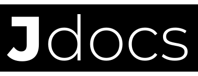

## 🧭 Welcome, Explorer! I'm Javier.

I'm a frontend developer with a strong passion for embedded systems and hardware tinkering. Currently, I'm on a continuous journey to deepen my expertise, both in modern web technologies and low-level embedded development.

Wanna see more of what I'm building (or breaking)?  
You can get to know me better at [my personal website](https://javierrayhan.my.id).

---

## 📌 Bio at a Glance

**Student at**

> [Telkom University](https://telkomuniversity.ac.id), Bandung (Informatics)

**Focus**

> IoT, Embedded Systems, Frontend Development, BLE Keyboards, AI

**Tech Stack**

  
  
  
  
  
  

**Software Used**

<!-- VSCode -->

<!-- Vercel -->

<!-- Cloudflare -->

<!-- Arduino IDE -->

<!-- PlatformIO -->

<!-- Notion -->

**Hobby**

> Playing violin, experimenting with electronics, building things that shouldn’t work (but sometimes do)

---

## 🌐 My Digital Stations

|                                                          |                                                                                                                                                                    |
| -------------------------------------------------------- | ------------------------------------------------------------------------------------------------------------------------------------------------------------------ |
| 

 | This is my personal website, you’ll find my portfolio, latest projects, contact links, and more in one spot!  [🔗 Click for visit](https://javierrayhan.my.id) |
|                         | I maintain a dedicated project site where I document my builds, experiments, and ideas in detail.  [🔗 Click for visit](https://docs.javierrayhan.my.id)       |

---

## 🤝 Connect With Me

If you're building something, learning something, or just vibing, ping me.

   

---

## 🧰 What I’m Building

Here’s a peek into the stuff I’ve been obsessing over lately:
 

#### [BLE Macro Keyboard with Layered Configs](https://github.com/javierrayhan/kato-macro-esp32)

> A custom BLE HID macro pad powered by **ESP32**, featuring 7 tactile keys and a rotary encoder, with seamless switching between 7 user-defined layers for advanced input control.

#### [ATmega32 CLI-based OS](https://github.com/javierrayhan/elena_cli-os)

> A bare-metal minimalist CLI OS, communicating over UART, packed into just **32KB** flash. Features include pin I/O control, I2C scanner, real-time clock, and a simple user management system, all without an RTOS.

#### [Qurban Finance Web App](https://github.com/javierrayhan/qurbanin-alhuda)

> A dedicated web app for the [Qurban](https://en.wikipedia.org/wiki/Udhiyah) community in my village for helping participants keep track of their savings, view contribution history, and manage their qurban preparations in a transparent, **user-friendly** way.

---

## Here's my Contribution Snake Pet

  

 

> # Just in case you want to support me and my Contribution Snake Pet.  > 

## 🧭 Welcome, Explorer! I'm Javier.

I'm a frontend developer with a strong passion for embedded systems and hardware tinkering. Currently, I'm on a continuous journey to deepen my expertise, both in modern web technologies and low-level embedded development.

Wanna see more of what I'm building (or breaking)?  
You can get to know me better at [my personal website](https://javierrayhan.my.id).

---

## 📌 Bio at a Glance

**Student at**

> [Telkom University](https://telkomuniversity.ac.id), Bandung (Informatics)

**Focus**

> IoT, Embedded Systems, Frontend Development, BLE Keyboards, AI

**Tech Stack**

  
  
  
  
  
  

**Hobby**

> Playing violin, experimenting with electronics, building things that shouldn’t work (but sometimes do)

---

## 🌐 My Digital Stations

|                                                          |                                                                                                                                                                    |
| -------------------------------------------------------- | ------------------------------------------------------------------------------------------------------------------------------------------------------------------ |
| 

 | This is my personal website, you’ll find my portfolio, latest projects, contact links, and more in one spot!  [🔗 Click for visit](https://javierrayhan.my.id) |
|                         | I maintain a dedicated project site where I document my builds, experiments, and ideas in detail.  [🔗 Click for visit](https://docs.javierrayhan.my.id)       |

---

## 🤝 Connect With Me

If you're building something, learning something, or just vibing, ping me.

   

---

## 🧰 What I’m Building

Here’s a peek into the stuff I’ve been obsessing over lately:
 

#### [BLE Macro Keyboard with Layered Configs](https://github.com/javierrayhan/kato-macro-esp32)

> A custom BLE HID macro pad powered by **ESP32**, featuring 7 tactile keys and a rotary encoder, with seamless switching between 7 user-defined layers for advanced input control.

#### [ATmega32 CLI-based OS](https://github.com/javierrayhan/elena_cli-os)

> A bare-metal minimalist CLI OS, communicating over UART, packed into just **32KB** flash. Features include pin I/O control, I2C scanner, real-time clock, and a simple user management system, all without an RTOS.

#### [Qurban Finance Web App](https://github.com/javierrayhan/qurbanin-alhuda)

> A dedicated web app for the [Qurban](https://en.wikipedia.org/wiki/Udhiyah) community in my village for helping participants keep track of their savings, view contribution history, and manage their qurban preparations in a transparent, **user-friendly** way.

#### [Ink-It-Down!](https://inkitdown.javierrayhan.my.id)

> An AI-powered Markdown editor designed for modern creators, featuring multi-tab navigation, intelligent assistance, and a real-time preview panel that helps you focus on content without distractions.

---

## Here's my Contribution Snake Pet

  

 

> Just in case you want to support me and my Contribution Snake Pet.  > 
